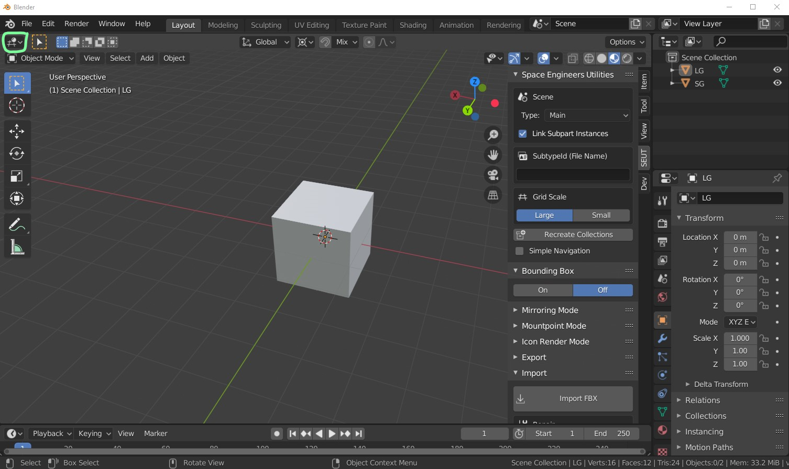
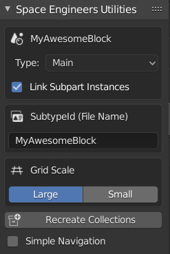
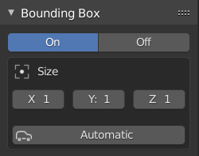
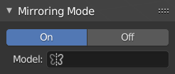
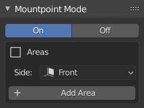
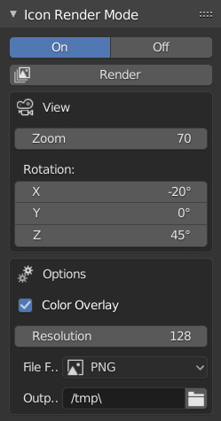
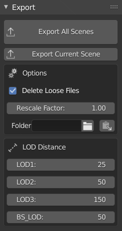
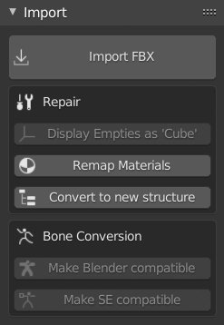

[Home](../index.html) | [Download](../download.html) | [Installation](../installation.html) | **Documentation** | [Troubleshooting](../troubleshooting.html) | [About](../about.html)

---

**[Documentation](../documentation.html)** | [Tutorials](../tutorials.html)

---

**Main Panel** | [Node Editor Panel](./node-editor-panel.html) | [Context / Add Menu](./context-menu.html) | [Object Properties](./object-properties.html) | [Preferences](./preferences.html) 

# Main Panel
The main SEUT panel holds the vast majority of the functionality of the addon. It can be found on the right side of the `3D Viewport` (button marked in green) of Blender and opened by pressing `N` while the cursor is within the viewport.

## Space Engineers Utilities

### MyAwesomeBlock
This is the scene name that is synced with the SubtypeId.

### Type
Allows selection of scene type. Depending on the scene type, a scene is exported differently and certain functionality becomes available. Valid types are:

* **Main** - This is the default scene type. Most of your scenes will be of this type.
* **Subpart** - This scene contains a subpart that is part of a `Main` scene. Refer to the [Subpart Tutorial]() to learn how to use subparts.
* **Mirroring** - This scene is the mirror model for another scene. Refer to the [Mirroring Tutorial]() for more details.
* **Character** - This scene contains a character model. It is treated in a specific way by the exporter to make it appear correctly ingame. Refer to the [Character Modding Tutorial]() for further details.
* **Character Animation** - This scene contains either a character pose or character animation and is treated differently by the exporter. Refer to the [Character Modding Tutorial]() for further details.

### SubtypeId
The SubtypeId is your model's unique identifier. It is written both into the SBC as well as written into the filename of the exported models. In scenes of type `Subpart`, `Character` and `Character Animation` it only defines the filename as no SBC is created for these on export.
The SubtypeId is furthermore used to mark all collections belonging to a scene so that they can be differntiated from same-function collections in other scenes.

| **Note:** SubtypeId must be unique within a blend file. Measures have been implemented to ensure that it is but there's still a small chance of it happening. If it does happen, undo to before it did. |

### Grid Scale
This option sets your Blender grid to align to the size of either large or small grid *within Space Engineers*. The grid is set to half the size of either to allow you to correctly place the blocks on world origin in Blender.
This setting is also used to by the addon to adjust what gets written to the SBC as well as to scale the bounding box so make sure it's set to the correct scale for your block.

### Recreate Collections
This button will create the various collections SEUT uses to organize your models within the active scene. The addon requires you to place all objects it should handle within one of these collections.

### Simple Navigation
By default, because SEUT relies on collections to organize your model, you will be switching between collections fairly often. However, generally you'll only really want to look at the contents of a single collection at a time. Enabling this option will hide all non-active collections automatically. Thus, whenever you click on another of the SEUT collections, it will be unhidden and all other collections will be hidden in turn.

## Bounding Box

## Mirroring Mode

## Mountpoint Mode

## Icon Render Mode

## Export

## Import
