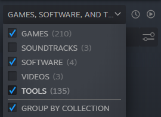
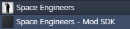

[Home](./index.html) | **Download** | [Installation](./installation.html) | [Documentation](./documentation.html) | [Troubleshooting](./troubleshooting.html) | [About](./about.html)

# Download

## Space Engineers Utilities

**SEUT Blender Addon** | 0.9.8 | [DOWNLOAD](https://github.com/enenra/space-engineers-utilities/releases/download/v0.9.8/space_engineers_utilities_0_9_8.zip)
**SEUT Supplementary Files** | 0.9.8 | [DOWNLOAD](https://github.com/enenra/space-engineers-utilities/releases/download/v0.9.8/SEUT.zip)

## Additional Required Tools

**Stollie's MWM Builder** | 0.1 | [DOWNLOAD](https://github.com/cstahlhut/MWMBuilder/releases)
**Custom FBX Importer** |  | [DOWNLOAD](https://github.com/harag-on-steam/fbximporter/releases/tag/havok2013.1-fbx2015.1)
**Havok Content Tools** |  | [DOWNLOAD](https://drive.google.com/open?id=1bXqAcIvzTHpxuAcMogduHqohL0zXq90i)

SEUT furthermore requires the **Space Engineers ModSDK**, which is available on **Steam**. Find it by activating `Tools` in your Steam Library:

And then download it:

