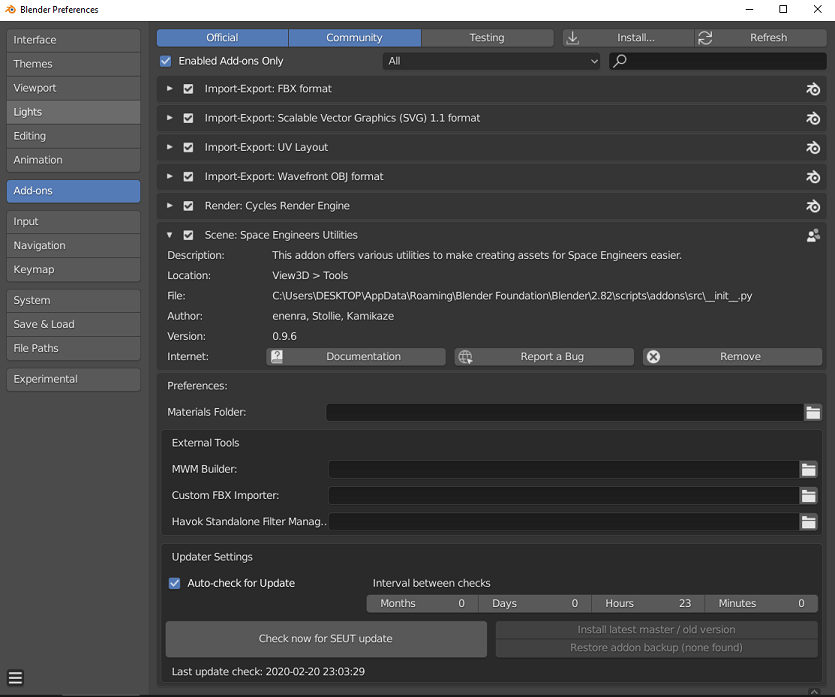

[Home](./index.html) | [Download](./download.html) | **Installation** | [Documentation](./documentation.html) | [Report Issue](https://github.com/enenra/space-engineers-utilities/issues/new) | [About](./about.html)

# Installation

1. Download the latest release of SEUT, its supplementary files and the additional required tools from the [download](./download.html)-section.

2. Unpack the SEUT Supplementary Files into a drive with ~15GB of available disk space. (Required for the converted textures.) This should yield you the following structure in the resulting directory:

```
SEUT\Materials\
SEUT\Textures\
SEUT\Tools\
```

3. Unpack the downloaded `StollieMWMBuilder.rar` into `SEUT\Tools\MWMB\`.

4. Place the downloaded `FBXImporter.exe` into `SEUT\Tools\`.

5. Install the downloaded Havok Content Tools to `SEUT\Tools\Havok\`.

6. Run `bulkTexConverter.exe` in `SEUT\Tools\`. Point it at the correct folders for your SE installation, SEUT Tools folder and SEUT Textures folder and load presets by using `File --> Load Presets` (top left of the window). Then run the conversion. This may take several minutes to complete.

7. Open Blender, go to `Edit --> Preferences... --> Add-ons` and toggle `Enabled Add-ons only` to `ON`.

8. Click `Install...` and select the just downloaded `space_engineers_utilities_***.zip`. The addon should now show up in the list:



9. Set the paths in the preferences of `Scene: Space Engineer Utilities` to the respective folder and tools.

10. In the Blender main view (`3D Viewport`), open the SEUT main panel by pressing `N`. On the right side of the viewport, a tab labelled `SEUT` will become available. This is where most of the functionality of SEUT is accessed from.

11. Go to the `Shading`-tab at the top of the Blender window. In the bottom center you will see the `Node Editor`. Press `N` with your cursor within the `Node Editor` to open up another toolbar will become available. Open the `SEUT`-tab and enable `MatLib_Presets` in the Material Libraries panel. If you wish to import vanilla Space Engineers models, also enable `MatLib_Materials` and `MatLib_Items`.